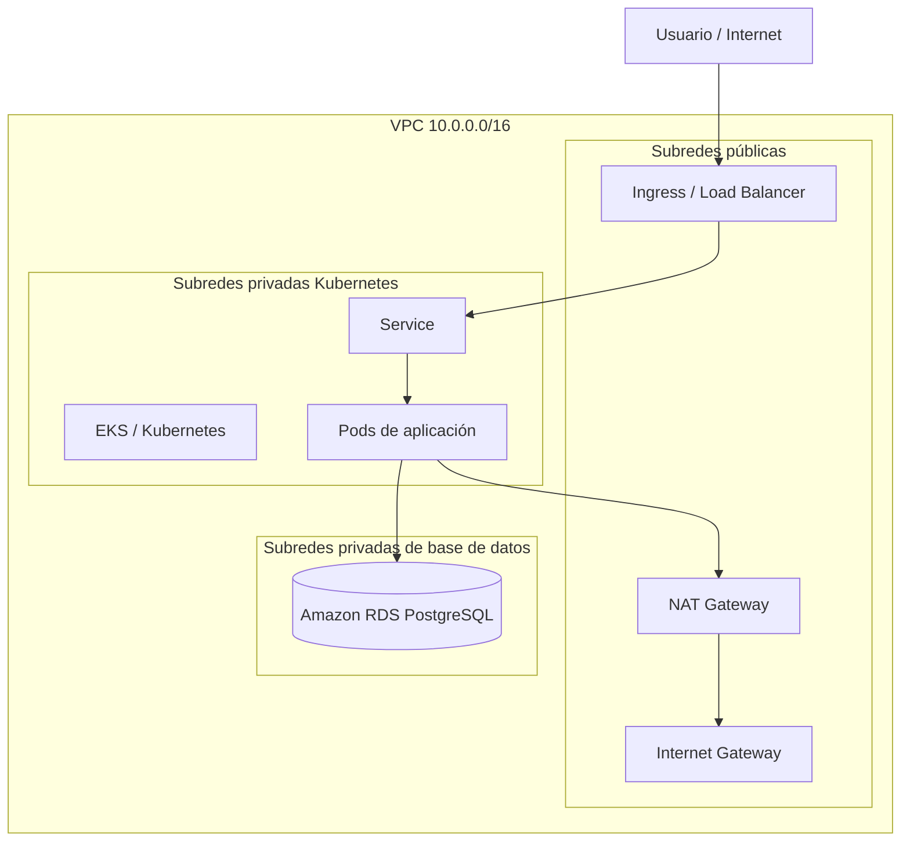

# ORT - Obligatorio Implementación de Soluciones Cloud

Repositorio del obligatorio de la materia **Implementación de Soluciones Cloud**.

El objetivo del proyecto es implementar una solución cloud en AWS utilizando **Terraform**, servicios administrados, documentación técnica y trabajo colaborativo mediante Git.

---

## Integrantes

| Integrante | Aporte principal |
|---|---|
| Fferreira | Infraestructura base, seguridad, RDS, monitoreo y documentación |
| JRecalde | Red, evolución de arquitectura, limpieza de ALB clásico y preparación para Kubernetes/EKS |

---

## Arquitectura objetivo

La arquitectura del proyecto evolucionó desde una propuesta clásica basada en EC2 hacia una solución orientada a Kubernetes.

El diseño objetivo es:

```text
Internet
  -> Ingress / Load Balancer gestionado por Kubernetes
  -> Service Kubernetes
  -> Pods de aplicación
  -> Amazon RDS PostgreSQL privado
```



---

## Decisión de arquitectura

Inicialmente se había previsto una arquitectura clásica:

```text
ALB -> EC2 / Auto Scaling Group -> Docker -> RDS
```

Luego se decidió evolucionar hacia Kubernetes/EKS. Por ese motivo se eliminaron el módulo de ALB clásico y el módulo de cómputo vacío.

La decisión se tomó para evitar duplicar componentes. En una arquitectura con Kubernetes, la publicación externa de la aplicación se realiza mediante **Ingress**, y el balanceador asociado es gestionado desde Kubernetes.

Terraform sigue siendo utilizado para crear la infraestructura base de AWS. Kubernetes será utilizado para desplegar y operar la aplicación.

---

## Componentes implementados

- VPC dedicada.
- Subredes públicas y privadas.
- Internet Gateway.
- NAT Gateway.
- Security Groups base.
- Amazon RDS PostgreSQL privado.
- Backups automáticos de RDS.
- Monitoreo inicial con CloudWatch.
- Terraform modular.
- Script de validación de estructura.
- Documentación técnica.

---

## Componentes pendientes

- Módulo Terraform para EKS.
- Manifiestos Kubernetes.
- Aplicación dockerizada.
- Namespace.
- Deployment.
- Service.
- Ingress.
- ConfigMap.
- Secret de ejemplo.
- Horizontal Pod Autoscaler.
- Pruebas finales.
- Evidencias de funcionamiento.

---

## Estructura del repositorio

```text
infraestructura/
  ambientes/
    academy/
  modulos/
    red/
    seguridad/
    base_datos/
    monitoreo/
    respaldos/

kubernetes/
aplicacion/
docs/
pruebas/
scripts/
.github/
```

---

## Cómo ejecutar

### 1. Clonar el repositorio

```bash
git clone git@github.com:Juchilgaa/ORT_ObligatorioISC-N5A-FFJR.git
cd ORT_ObligatorioISC-N5A-FFJR
```

Si el repositorio ya estaba clonado:

```bash
git checkout main
git pull origin main
```

### 2. Configurar credenciales AWS Academy

Iniciar el **Learner Lab** y copiar las credenciales desde:

```text
AWS Academy -> Learner Lab -> AWS Details -> AWS CLI
```

Editar credenciales:

```bash
vi ~/.aws/credentials
```

Formato esperado:

```ini
[default]
aws_access_key_id=...
aws_secret_access_key=...
aws_session_token=...
```

Editar configuración:

```bash
vi ~/.aws/config
```

Formato esperado:

```ini
[default]
region=us-east-1
output=json
cli_pager=
```

Validar acceso:

```bash
aws sts get-caller-identity
```

Si aparece `ExpiredToken`, copiar nuevamente las credenciales desde AWS Academy.

### 3. Crear archivo de variables local

El archivo real `terraform.tfvars` no se sube al repositorio porque puede contener datos sensibles.

```bash
cp terraform.tfvars.example infraestructura/ambientes/academy/terraform.tfvars
```

Editar:

```bash
vi infraestructura/ambientes/academy/terraform.tfvars
```

Cambiar valores sensibles como la contraseña de RDS.

### 4. Validar estructura del proyecto

Desde la raíz del repositorio:

```bash
./scripts/validar-estructura.sh
```

Resultado esperado:

```text
Validación finalizada sin errores
```

### 5. Ejecutar Terraform

Terraform se ejecuta desde el ambiente `academy`:

```bash
cd infraestructura/ambientes/academy
terraform init
terraform fmt -recursive
terraform validate
terraform plan
```

Luego de revisar el plan:

```bash
terraform apply
```

Confirmar con:

```text
yes
```

Para destruir la infraestructura al finalizar:

```bash
terraform destroy
```

---

## Kubernetes

Kubernetes se incorpora como evolución de la solución para administrar la capa de aplicación de forma declarativa.

La estructura prevista es:

```text
kubernetes/
  namespaces/
  config/
  app/
```

Componentes previstos:

- Namespace.
- Deployment.
- Service.
- Ingress.
- ConfigMap.
- Secret de ejemplo.
- HorizontalPodAutoscaler.

---

## Documentación

La documentación técnica se encuentra en:

```text
docs/
```

Documentos principales:

- `docs/01-alcance.md`
- `docs/03-red-y-seguridad.md`
- `docs/07-rds-y-respaldos.md`
- `docs/08-monitoreo.md`
- `docs/09-kubernetes.md`
- `docs/11-uso-de-ia.md`
- `docs/12-matriz-trazabilidad.md`
- `docs/13-runbook-operativo.md`
- `docs/decisiones/decision-kubernetes.md`

---

## Estado actual

Implementado:

- Red.
- Seguridad base.
- RDS.
- Backups automáticos.
- Monitoreo inicial.
- Documentación técnica.
- Script de validación.
- Limpieza de módulos no utilizados para la arquitectura Kubernetes.

Pendiente:

- Módulo Terraform de EKS.
- Manifiestos Kubernetes.
- Aplicación Dockerizada.
- Ingress.
- Pruebas finales.
- Evidencias.
