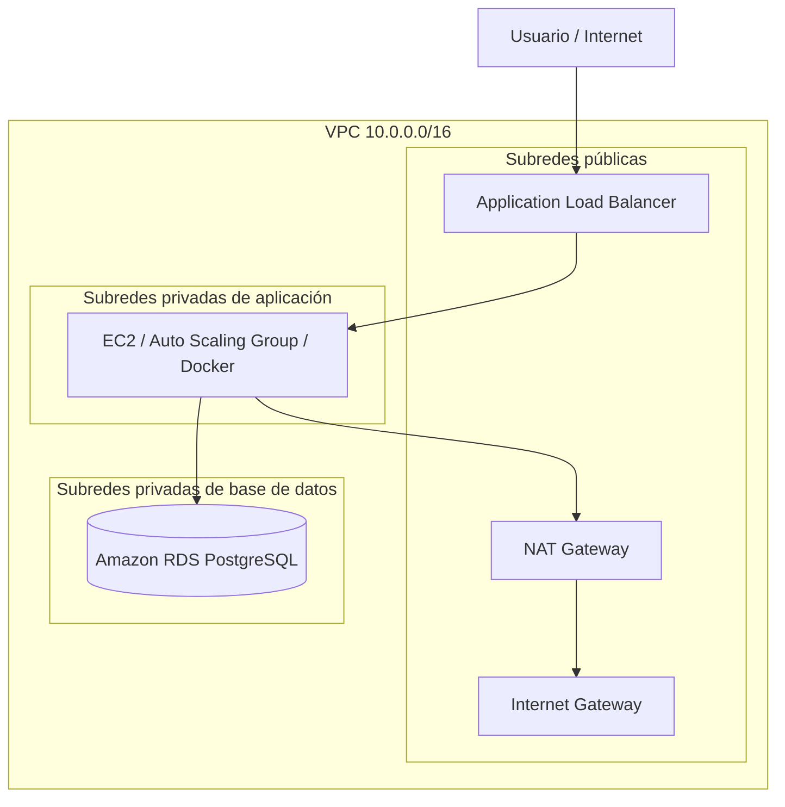

# ORT - Obligatorio Implementación de Soluciones Cloud

Repositorio del obligatorio de la materia **Implementación de Soluciones Cloud**.

El objetivo del proyecto es implementar en AWS una arquitectura equivalente y mejorada a la solución planteada en la letra del obligatorio, utilizando **Terraform**, servicios administrados de AWS, documentación técnica y trabajo colaborativo mediante Git.

---

## Integrantes

| Integrante | Aporte principal |
|---|---|
| Fferreira |
| JRecalde |

---

## Arquitectura

La solución base se apoya en una arquitectura clásica en AWS:

```text
Internet
  -> Application Load Balancer público
  -> Capa de aplicación privada
  -> Amazon RDS PostgreSQL privado
```



---

## Componentes implementados

- VPC dedicada.
- Subredes públicas y privadas en dos zonas de disponibilidad.
- Internet Gateway y NAT Gateway.
- Application Load Balancer.
- Target Group.
- Security Groups por capa.
- Amazon RDS PostgreSQL privado.
- Backups automáticos de RDS.
- Monitoreo con CloudWatch.
- Dashboard y alarmas.
- Terraform modular.
- Script de validación de estructura.

---

## Estructura del repositorio

```text
infraestructura/
  ambientes/
    academy/
  modulos/
    red/
    seguridad/
    balanceador/
    computo/
    base_datos/
    monitoreo/
    respaldos/

aplicacion/
docs/
pruebas/
scripts/
.github/
```

---

## Cómo ejecutar

### 1. Clonar el repositorio

```bash
git clone git@github.com:Juchilgaa/ORT_ObligatorioISC-N5A-FFJR.git
cd ORT_ObligatorioISC-N5A-FFJR
```

Si el repositorio ya estaba clonado:

```bash
git checkout main
git pull origin main
```

---

### 2. Configurar credenciales AWS Academy

Iniciar el **Learner Lab** y copiar las credenciales desde:

```text
AWS Academy -> Learner Lab -> AWS Details -> AWS CLI
```

Editar credenciales:

```bash
vi ~/.aws/credentials
```

Formato esperado:

```ini
[default]
aws_access_key_id=...
aws_secret_access_key=...
aws_session_token=...
```

Editar configuración:

```bash
vi ~/.aws/config
```

Formato esperado:

```ini
[default]
region=us-east-1
output=json
cli_pager=
```

Validar acceso:

```bash
aws sts get-caller-identity
```

Si aparece `ExpiredToken`, copiar nuevamente las credenciales desde AWS Academy.

---

### 3. Validar estructura del proyecto

Desde la raíz del repositorio:

```bash
./scripts/validar-estructura.sh
```

Resultado esperado:

```text
Validación finalizada sin errores
```

---

### 4. Crear variables locales

El archivo real `terraform.tfvars` no se sube al repositorio.

Crear una copia desde el ejemplo:

```bash
cp terraform.tfvars.example infraestructura/ambientes/academy/terraform.tfvars
```

Editar valores sensibles:

```bash
vi infraestructura/ambientes/academy/terraform.tfvars
```

Cambiar, por ejemplo:

```hcl
db_password = "CAMBIAR_ESTA_PASSWORD"
```

---

### 5. Validar Terraform

Terraform se ejecuta desde el ambiente `academy`:

```bash
cd infraestructura/ambientes/academy
terraform init
terraform fmt -recursive
terraform validate
terraform plan
```

No ejecutar Terraform desde la raíz del repositorio.

---

### 6. Aplicar infraestructura

Luego de revisar el plan:

```bash
terraform apply
```

Confirmar con:

```text
yes
```

Se recomienda que este paso lo ejecute un solo integrante para evitar inconsistencias de estado.

---

### 7. Ver outputs

```bash
terraform output
```

Para obtener el DNS del balanceador:

```bash
terraform output alb_dns_name
```

---

### 8. Destruir infraestructura

Al finalizar las pruebas:

```bash
terraform destroy
```

Confirmar con:

```text
yes
```

---

## Docker

Docker está previsto para ejecutar la aplicación dentro de la capa de cómputo.

Diseño esperado:

```text
ALB -> Auto Scaling Group -> EC2 privada -> Docker container -> RDS
```

Pendiente:

- Crear aplicación.
- Agregar `Dockerfile`.
- Ejecutar contenedor desde EC2 mediante `user_data`.
- Registrar instancias en el Target Group.

---

## Kubernetes

Kubernetes no forma parte de la arquitectura base implementada, pero queda planteado como evolución posible del proyecto.

La solución base con ALB, EC2, Auto Scaling Group, Docker y RDS cubre los requerimientos principales sin agregar complejidad innecesaria.

Como siguiente etapa, se podrá evaluar:

```text
Internet -> ALB / Ingress -> Kubernetes -> Pods -> RDS
```

Componentes previstos:

- Namespace.
- Deployment.
- Service.
- Ingress.
- ConfigMap.
- Secret.
- HorizontalPodAutoscaler.

---

## Documentación

La documentación técnica se encuentra en:

```text
docs/
```

Documentos principales:

- `docs/01-alcance.md`
- `docs/03-red-y-seguridad.md`
- `docs/07-rds-y-respaldos.md`
- `docs/08-monitoreo.md`
- `docs/11-uso-de-ia.md`
- `docs/12-matriz-trazabilidad.md`
- `docs/13-runbook-operativo.md`

---

## Estado actual

Implementado:

- Red.
- Seguridad.
- Balanceador.
- RDS.
- Backups automáticos.
- Monitoreo.
- Documentación técnica.
- Script de validación.

Pendiente:

- Módulo de cómputo.
- Aplicación Dockerizada.
- Integración final con Target Group.
- Evaluación/incorporación de Kubernetes.
- Evidencias de pruebas.
